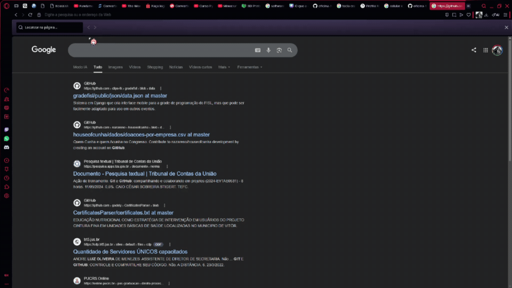

<h1 align="center">Nome do projeto</h1> 

## O que foi feito no projeto?

<h1 align="center">Ferramentas que foram ultilizadas</h1>

  
  Primeira ferramenta que ultilizamos foi o canva  para criar os slides. Por questão de conter vários templates, e ser fácil a utilização, além de ser bem mais conhecido e ser bem melhor no compartilhamento dos arquivos.

  
  Segunda ferramenta a ser utilizada foi o Google docs, para a criação do relatório dos integrantes do grupo.

  
<h1 align="center">Como acessar e executar o material</h1> 

  
  Pelo celular.

  

  
  Pelo computador.

  

<strong>Observação:</strong> 
Não muda muita coisa do processo do celular, pois meu gravador não me permitiu gravar o tutorial completo mas é a mesma coisa que no tutorial do celular.

<h1 align="center">Integrantes do grupo</h1> 
